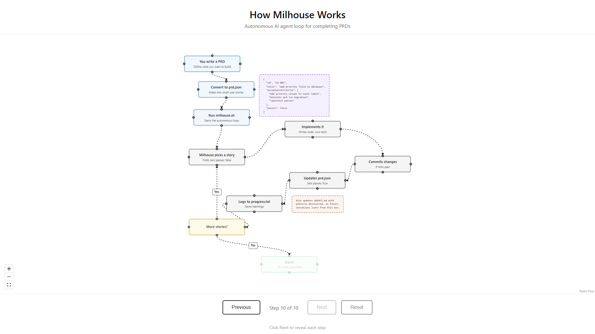

# Milhouse


Milhouse is a Codex-only autonomous agent loop. It runs fresh `codex exec` sessions repeatedly until every story in `prd.json` is complete. Memory persists through git history, `progress.txt`, `prd.json`, and AGENTS.md files.

## Prerequisites

- [Codex CLI](https://developers.openai.com/codex/) installed and authenticated
- Bash
- `jq`
- A git repository for the target project

## Setup

### Copy Milhouse Into a Project

From your project root:

```bash
mkdir -p scripts/milhouse
cp /path/to/milhouse/milhouse.sh scripts/milhouse/
cp /path/to/milhouse/CODEX.md scripts/milhouse/
chmod +x scripts/milhouse/milhouse.sh
```

Milhouse keeps its state beside the script, so `prd.json`, `progress.txt`, `.last-branch`, and `archive/` should live in `scripts/milhouse/` when you use this layout.

### Install Skills for Codex

```bash
cp -r skills/prd ~/.codex/skills/
cp -r skills/milhouse ~/.codex/skills/
```

Available skills after installation:

- `/prd` - Generate Product Requirements Documents
- `/milhouse` - Convert PRDs to Milhouse `prd.json` format

## Workflow

### 1. Create a PRD

Use the PRD skill to generate a detailed requirements document:

```text
Load the prd skill and create a PRD for [your feature description]
```

### 2. Convert the PRD

Use the Milhouse skill to convert the markdown PRD to JSON:

```text
Load the milhouse skill and convert tasks/prd-[feature-name].md to scripts/milhouse/prd.json
```

### 3. Run Milhouse

From the target project root:

```bash
./scripts/milhouse/milhouse.sh
```

Set a max iteration count:

```bash
./scripts/milhouse/milhouse.sh 20
```

Each iteration starts a fresh non-interactive Codex session with:

```bash
codex exec --cd "$WORKSPACE_DIR" --sandbox danger-full-access --ask-for-approval never -
```

Milhouse will:

1. Read `prd.json` and `progress.txt`
2. Create or switch to the PRD `branchName`
3. Pick the highest priority story where `passes: false`
4. Implement that single story
5. Run relevant quality checks
6. Commit if checks pass
7. Update `prd.json` to mark the story as `passes: true`
8. Append learnings to `progress.txt`
9. Repeat until all stories pass or max iterations is reached

## Run From Codex App

Codex App can open the workspace:

```bash
codex app .
```

Once the workspace is open, run Milhouse from an app-accessible terminal:

```bash
./scripts/milhouse/milhouse.sh
```

You can also ask Codex in the app to run that command. The local Codex CLI currently exposes workspace opening through `codex app .`; it does not expose a repo-defined one-click script launcher, so the shell command remains the execution path.

## Future UI Option

A small standalone npm webpage would be a good wrapper later. Keep it separate from this rewrite.

Suggested shape:

- Vite frontend with Start, Stop, and max-iteration controls
- Express backend that launches `./milhouse.sh` as a child process
- Live log streaming from stdout and stderr
- Current PRD story status from `prd.json`
- Clear running, completed, failed, and stopped states

## Key Files

| File | Purpose |
|------|---------|
| `milhouse.sh` | Codex loop runner |
| `CODEX.md` | Prompt given to each Codex iteration |
| `prd.json` | User stories with `passes` status |
| `prd.json.example` | Sample PRD format for reference |
| `progress.txt` | Append-only progress and learnings |
| `skills/prd/` | Skill for generating PRDs |
| `skills/milhouse/` | Skill for converting PRDs to JSON |
| `.codex-plugin/` | Plugin manifest for Codex plugin discovery |
| `flowchart/` | Interactive visualization of how Milhouse works |

## Flowchart

[](https://snarktank.github.io/milhouse/)

**[View Interactive Flowchart](https://snarktank.github.io/milhouse/)** - Click through to see each step with animations.

The `flowchart/` directory contains the source code. To run locally:

```bash
cd flowchart
npm install
npm run dev
```

## Core Concepts

### Each Iteration Has Fresh Context

Each iteration starts a new Codex session. The only memory between iterations is:

- Git history
- `progress.txt`
- `prd.json`
- AGENTS.md files

### Keep Stories Small

Each PRD item should be small enough to complete in one context window.

Right-sized stories:

- Add a database column and migration
- Add a UI component to an existing page
- Update a server action with new logic
- Add a filter dropdown to a list

Too large:

- Build the entire dashboard
- Add all authentication flows
- Refactor the entire API

### AGENTS.md Updates Matter

After each iteration, Milhouse asks Codex to update relevant AGENTS.md files with reusable patterns, gotchas, and conventions. Future iterations automatically benefit from that local knowledge.

### Feedback Loops Matter

Milhouse only works well when the target project has checks Codex can run:

- Typecheck
- Tests
- Lint
- Build
- Browser verification for UI stories when browser tooling is available

### Stop Condition

When all stories have `passes: true`, Codex outputs:

```xml
<promise>COMPLETE</promise>
```

The loop detects that signal and exits successfully.

## Debugging

Check current state:

```bash
cat scripts/milhouse/prd.json | jq '.userStories[] | {id, title, passes}'
cat scripts/milhouse/progress.txt
git log --oneline -10
```

## Customizing the Prompt

After copying `CODEX.md` into your project, customize it with:

- Project-specific quality check commands
- Codebase conventions
- Common gotchas for your stack
- Required browser verification steps

## Archiving

Milhouse automatically archives previous runs when you start a new feature with a different `branchName`. Archives are saved to `archive/YYYY-MM-DD-feature-name/` beside the runner.
